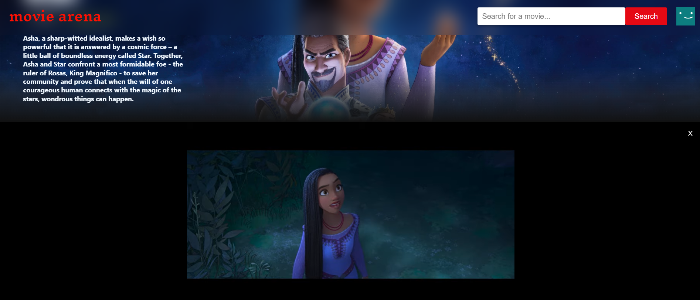

## 🎬 MovieArena
MovieArena is a captivating React application designed to showcase detailed movie information fetched from the TMDB API. The project boasts a user-friendly and responsive interface, enabling users to explore movies effortlessly. Here's a breakdown of its key features, technologies used, and how to get started:

## 🚀 Features
Detailed Movie Information: MovieArena provides comprehensive details about various movies fetched from the TMDB API, allowing users to explore information such as synopsis, cast, reviews, and ratings.

Efficient Movie Searches: Users can easily search for their favorite movies using the search functionality, enhancing their browsing experience.

Seamless Trailer Display: MovieArena seamlessly integrates trailers for movies, offering users a glimpse into the film before watching.

## 🛠 Technologies Used
**React.js:** MovieArena leverages React.js for building dynamic and interactive user interfaces.

**TMDB API:** The application fetches movie data from the TMDB API, ensuring access to a vast repository of movie information.

**Context API:** Context API is utilized for managing global state within the application, ensuring efficient data management and sharing across components.

## 📷 Preview
 

  
  

## 🛠 Getting Started
**Clone the repository:**
https://github.com/ajps208/Moviearena.git
**Navigate to the project directory:**
cd moviearena
**Install dependencies:**
npm install
## ⚙️ Configuration
Obtain an API key from the TMDB API website.
Configure the API key in the appropriate files for fetching movie data.
## ▶️ Usage
Run the application:
npm start
Access MovieArena in your browser at:
**http://localhost:3000**
## 🤝 Contributing
Contributions to MovieArena are welcome! Please refer to the guidelines outlined in the CONTRIBUTING.md file for details on how to contribute to the project.

Feel free to explore the codebase and contribute to the enhancement of MovieArena!
